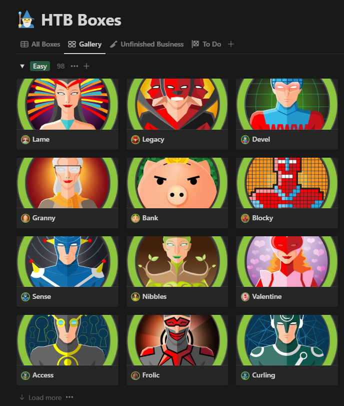
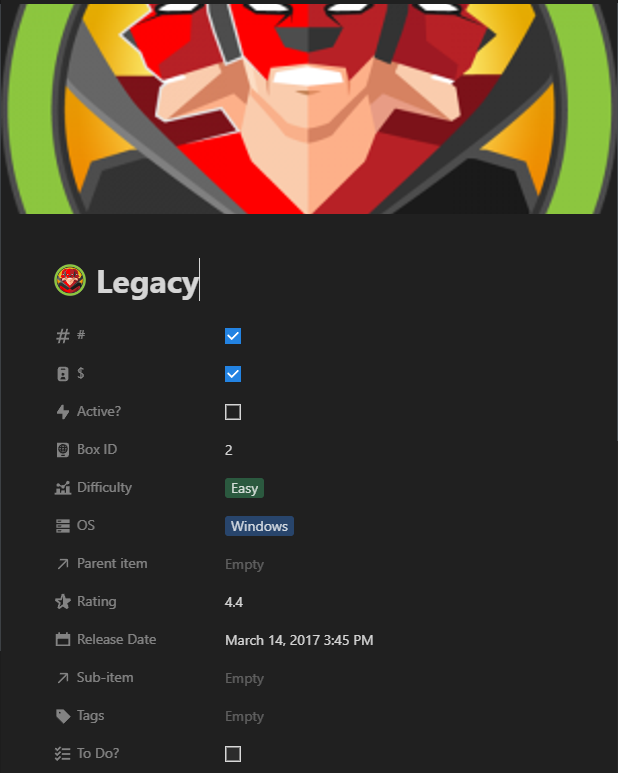
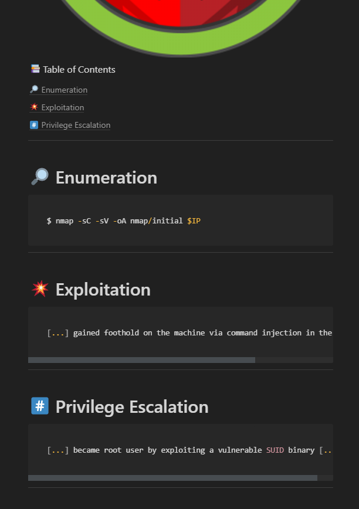

# docsthebox

## whats this?

docsthebox hits the hackthebox api and gets all api data on the machines.
machines are stored in specified notion database if not already existing.
each page has basic templates attached to help document your explotation.

## whats needed?

buttons to start stop machines?
submit user/root flags?
update a box in db via button click
use notionx library over raw json + requests
code cleanup and commenting

## known bugs

the icons and covers loaded perfectly in notion when this was first developed.
hackthebox has an incredibly aggresive cloudflare configuration and notion can
not fetch the images from hackthebox's storage without receiving a 403 denied.
some alternative method might need to be developed and implemened if that's an
important thing you'd like to see fixed. we'd also appreciate all incoming PRs

## creds

- [ritchies](https://github.com/ritchies)

 - [goproslowyo](https://github.com/goproslowyo)

- thomas frank for inspiration

