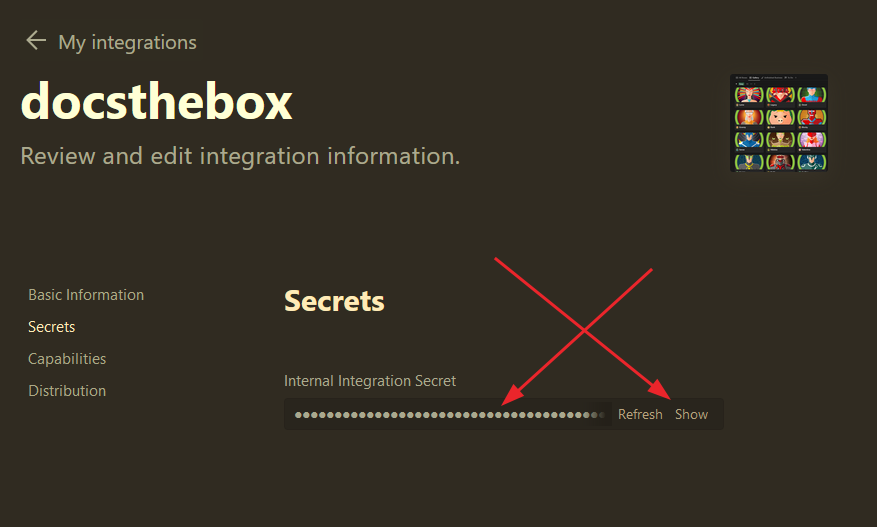

# How To Use

- Create a Notion Developer Integration

  - [Notion Integrations](https://www.notion.so/my-integrations)

  

  - Get a Notion Internal Integration Secret

  

- Duplicate the Notion template

  - [Notion Template](https://infosecinfo.notion.site/fd6bd562b7644ac7a69d254a555ef5c3?v=da10fc398b3b468091fe8e933e16cfb0&pvs=4)

  

  - Choose workspace to duplicate to

  

- Get the Notion DB ID from the URL (yours will be unique from the screenshot)

  

- Authorize the Notion Integration to access your new Notion database

  

  

- Get a Hack The Box app token from your profile settings page

  - [Profile Settings](https://app.hackthebox.com/profile/settings)

  

---

By now you should have three things:

  1. A Notion Internal Integration Secret

  1. The database ID of your Notion DB

  1. Your Hack The Box App Token

If don't have these items please review the above steps again.

- Install Poetry (you don't need poetry really, just requests, but poetry makes it easier if the project grows)

  - `pip install --user poetry`

  - `oetry run python box-to-docs.py --help`

  or

  - `pip install --user requests`

  - `python box-to-docs.py`

  or

  - `docker run -v /tmp:/tmp ghcr.io/goproslowyo/docsthebox:latest --help`

NOTE: Please adjust the paths accordingly if you're on windows.
